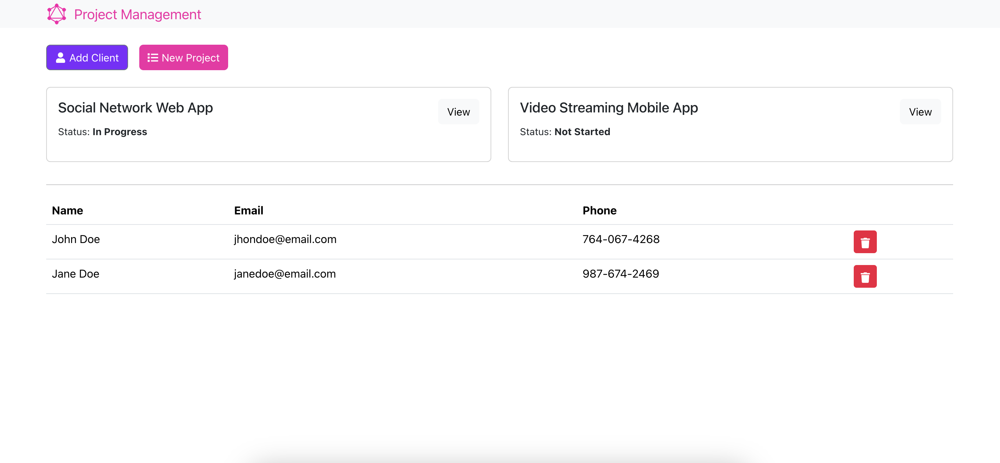

# Project Management

This is a Project Management Web Application build using MERN stack with GraphQL.



## Usage
### Install
1. Install Docker for your OS.
2. Install the Docker Compose tool.
3. Run docker-compose
```
docker-compose up -d --build
```
This will start server, client and MongoDB.